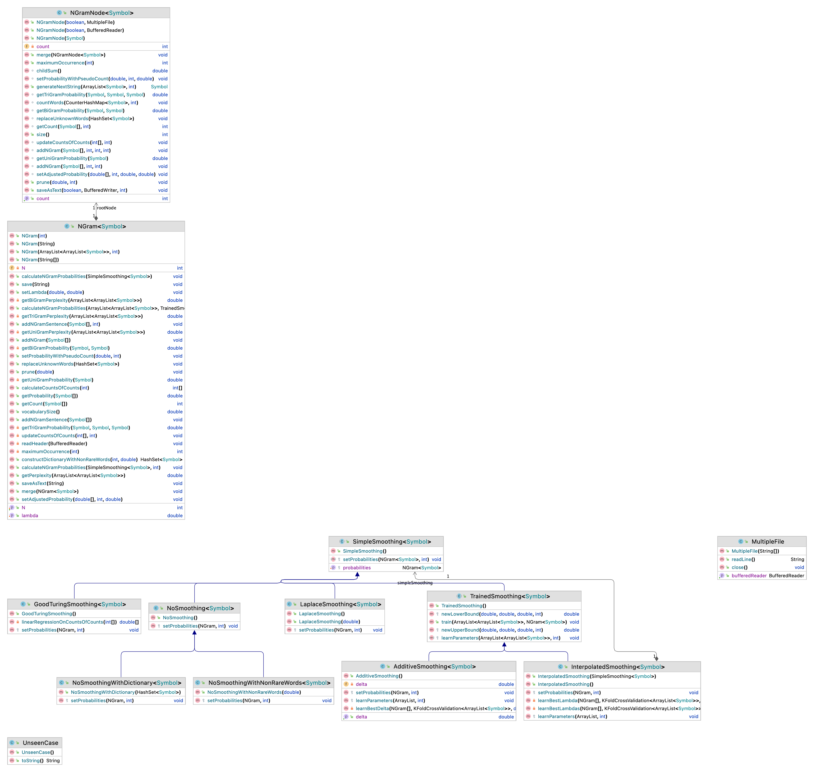

N-Gram
============

An N-gram is a sequence of N words: a 2-gram (or bigram) is a two-word sequence of words like “lütfen ödevinizi”, “ödevinizi çabuk”, or ”çabuk veriniz”, and a 3-gram (or trigram) is a three-word sequence of words like “lütfen ödevinizi çabuk”, or “ödevinizi çabuk veriniz”.

## Smoothing

To keep a language model from assigning zero probability to unseen events, we’ll have to shave off a bit of probability mass from some more frequent events and give it to the events we’ve never seen. This modification is called smoothing or discounting.

### Laplace Smoothing

The simplest way to do smoothing is to add one to all the bigram counts, before we normalize them into probabilities. All the counts that used to be zero will now have a count of 1, the counts of 1 will be 2, and so on. This algorithm is called Laplace smoothing.

### Add-k Smoothing

One alternative to add-one smoothing is to move a bit less of the probability mass from the seen to the unseen events. Instead of adding 1 to each count, we add a fractional count k. This algorithm is therefore called add-k smoothing.

Video Lectures
============

[](https://youtu.be/oNWKVUdPUJY)[](https://youtu.be/ZG5m6OFdudI)

For Developers
============

You can also see [Python](https://github.com/starlangsoftware/NGram-Py), [Cython](https://github.com/starlangsoftware/NGram-Cy), [C](https://github.com/starlangsoftware/NGram-C), [C++](https://github.com/starlangsoftware/NGram-CPP), [Swift](https://github.com/starlangsoftware/NGram-Swift), [Js](https://github.com/starlangsoftware/NGram-Js), or [C#](https://github.com/starlangsoftware/NGram-CS) repository.

## Requirements

* [Java Development Kit 8 or higher](#java), Open JDK or Oracle JDK
* [Maven](#maven)
* [Git](#git)

### Java 

To check if you have a compatible version of Java installed, use the following command:

    java -version
    
If you don't have a compatible version, you can download either [Oracle JDK](https://www.oracle.com/technetwork/java/javase/downloads/jdk8-downloads-2133151.html) or [OpenJDK](https://openjdk.java.net/install/)    

### Maven
To check if you have Maven installed, use the following command:

    mvn --version
    
To install Maven, you can follow the instructions [here](https://maven.apache.org/install.html).     

### Git

Install the [latest version of Git](https://git-scm.com/book/en/v2/Getting-Started-Installing-Git).

## Download Code

In order to work on code, create a fork from GitHub page. 
Use Git for cloning the code to your local or below line for Ubuntu:

	git clone <your-fork-git-link>

A directory called SpellChecker will be created. Or you can use below link for exploring the code:

	git clone https://github.com/olcaytaner/NGram.git

## Open project with IntelliJ IDEA

Steps for opening the cloned project:

* Start IDE
* Select **File | Open** from main menu
* Choose `NGram/pom.xml` file
* Select open as project option
* Couple of seconds, dependencies with Maven will be downloaded. 

## Compile

**From IDE**

After being done with the downloading and Maven indexing, select **Build Project**  option from **Build** menu. After compilation process, user can run `NGram`.

**From Console**

Use below line to generate jar file:

     mvn install

## Maven Usage

        <dependency>
            <groupId>io.github.starlangsoftware</groupId>
            <artifactId>NGram</artifactId>
            <version>1.0.20</version>
        </dependency>

Detailed Description
============

+ [Training NGram](#training-ngram)
+ [Using NGram](#using-ngram)
+ [Saving NGram](#saving-ngram)
+ [Loading NGram](#loading-ngram)

## Training NGram
     
To create an empty NGram model:

	NGram(int N)

For example,

	a = NGram(2);

this creates an empty NGram model.

To add an sentence to NGram

	void addNGramSentence(Symbol[] symbols)

For example,

	String[] text1 = {"jack", "read", "books", "john", "mary", "went"};
	String[] text2 = {"jack", "read", "books", "mary", "went"};
	nGram = new NGram<String>(2);
	nGram.addNGramSentence(text1);
	nGram.addNGramSentence(text2);

with the lines above, an empty NGram model is created and the sentences text1 and text2 are
added to the bigram model.

Another possibility is to create an Ngram from a corpus consisting of two dimensional String array such as

	ArrayList<ArrayList<String>> corpus;
	nGram = new NGram<>(simpleCorpus, 1);

### Training With Smoothings

NoSmoothing class is the simplest technique for smoothing. It doesn't require training.
Only probabilities are calculated using counters. For example, to calculate the probabilities
of a given NGram model using NoSmoothing:

	a.calculateNGramProbabilities(new NoSmoothing());

LaplaceSmoothing class is a simple smoothing technique for smoothing. It doesn't require
training. Probabilities are calculated adding 1 to each counter. For example, to calculate
the probabilities of a given NGram model using LaplaceSmoothing:

	a.calculateNGramProbabilities(new LaplaceSmoothing());

GoodTuringSmoothing class is a complex smoothing technique that doesn't require training.
To calculate the probabilities of a given NGram model using GoodTuringSmoothing:

	a.calculateNGramProbabilities(new GoodTuringSmoothing());

AdditiveSmoothing class is a smoothing technique that requires training.

	a.calculateNGramProbabilities(new AdditiveSmoothing());

## Using NGram

To find the probability of an NGram:

	double getProbability(Symbol ... symbols)

For example, to find the bigram probability:

	a.getProbability("jack", "reads")

To find the trigram probability:

	a.getProbability("jack", "reads", "books")

## Saving NGram
    
To save the NGram model:

	void saveAsText(String fileName)

For example, to save model "a" to the file "model.txt":

	a.saveAsText("model.txt");              

## Loading NGram            

To load an existing NGram model:

	NGram(String fileName)

For example,

	a = NGram("model.txt");

this loads an NGram model in the file "model.txt".

For Contibutors
============

### Class Diagram



### pom.xml file
1. Standard setup for packaging is similar to:
```
    <groupId>io.github.starlangsoftware</groupId>
    <artifactId>Amr</artifactId>
    <version>1.0.0</version>
    <packaging>jar</packaging>
    <name>NlpToolkit.Amr</name>
    <description>Abstract Meaning Representation Library</description>
    <url>https://github.com/StarlangSoftware/Amr</url>

    <organization>
        <name>io.github.starlangsoftware</name>
        <url>https://github.com/starlangsoftware</url>
    </organization>

    <licenses>
        <license>
            <name>The Apache Software License, Version 2.0</name>
            <url>http://www.apache.org/licenses/LICENSE-2.0.txt</url>
        </license>
    </licenses>

    <developers>
        <developer>
            <name>Olcay Taner Yildiz</name>
            <email>olcay.yildiz@ozyegin.edu.tr</email>
            <organization>Starlang Software</organization>
            <organizationUrl>http://www.starlangyazilim.com</organizationUrl>
        </developer>
    </developers>

    <scm>
        <connection>scm:git:git://github.com/starlangsoftware/amr.git</connection>
        <developerConnection>scm:git:ssh://github.com:starlangsoftware/amr.git</developerConnection>
        <url>http://github.com/starlangsoftware/amr/tree/master</url>
    </scm>

    <properties>
        <maven.compiler.source>1.8</maven.compiler.source>
        <maven.compiler.target>1.8</maven.compiler.target>
        <project.build.sourceEncoding>UTF-8</project.build.sourceEncoding>
    </properties>
```
2. Only top level dependencies should be added. Do not forget junit dependency.
```
    <dependencies>
        <dependency>
            <groupId>io.github.starlangsoftware</groupId>
            <artifactId>AnnotatedSentence</artifactId>
            <version>1.0.78</version>
        </dependency>
        <dependency>
            <groupId>junit</groupId>
            <artifactId>junit</artifactId>
            <version>4.13.1</version>
            <scope>test</scope>
        </dependency>
    </dependencies>
```
3. Maven compiler, gpg, source, javadoc plugings should be added.
```
	<plugin>
		<groupId>org.apache.maven.plugins</groupId>
		<artifactId>maven-compiler-plugin</artifactId>
		<version>3.6.1</version>
		<configuration>
			<source>1.8</source>
			<target>1.8</target>
		</configuration>
	</plugin>
	<plugin>
		<groupId>org.apache.maven.plugins</groupId>
		<artifactId>maven-gpg-plugin</artifactId>
		<version>1.6</version>
		<executions>
			<execution>
				<id>sign-artifacts</id>
				<phase>verify</phase>
				<goals>
					<goal>sign</goal>
				</goals>
			</execution>
		</executions>
	</plugin>
	<plugin>
		<groupId>org.apache.maven.plugins</groupId>
		<artifactId>maven-source-plugin</artifactId>
		<version>2.2.1</version>
		<executions>
			<execution>
				<id>attach-sources</id>
				<goals>
					<goal>jar-no-fork</goal>
				</goals>
			</execution>
		</executions>
	</plugin>
	<plugin>
		<groupId>org.apache.maven.plugins</groupId>
		<artifactId>maven-javadoc-plugin</artifactId>
		<configuration>
			<source>8</source>
		</configuration>
		<version>3.10.0</version>
		<executions>
			<execution>
				<id>attach-javadocs</id>
				<goals>
					<goal>jar</goal>
				</goals>
			</execution>
		</executions>
	</plugin>
```
4. Currently publishing plugin is Sonatype.
```
	<plugin>
		<groupId>org.sonatype.central</groupId>
		<artifactId>central-publishing-maven-plugin</artifactId>
		<version>0.8.0</version>
		<extensions>true</extensions>
		<configuration>
			<publishingServerId>central</publishingServerId>
			<autoPublish>true</autoPublish>
		</configuration>
	</plugin>
```
5. For UI jar files use assembly plugins.
```
	<plugin>
		<groupId>org.apache.maven.plugins</groupId>
		<artifactId>maven-assembly-plugin</artifactId>
		<version>2.2-beta-5</version>
		<executions>
			<execution>
				<id>sentence-dependency</id>
				<phase>package</phase>
				<goals>
					<goal>single</goal>
				</goals>
				<configuration>
					<archive>
						<manifest>
							<mainClass>Amr.Annotation.TestAmrFrame</mainClass>
						</manifest>
					</archive>
					<finalName>amr</finalName>
				</configuration>
			</execution>
		</executions>
		<configuration>
			<descriptorRefs>
				<descriptorRef>jar-with-dependencies</descriptorRef>
			</descriptorRefs>
			<appendAssemblyId>false</appendAssemblyId>
		</configuration>
	</plugin>
```
### Resources
1. Add resources to the resources subdirectory. These will include image files (necessary for UI), data files, etc.
   
### Java files
1. Do not forget to comment each function.
```
    /**
     * Returns the value of a given layer.
     * @param viewLayerType Layer for which the value questioned.
     * @return The value of the given layer.
     */
    public String getLayerInfo(ViewLayerType viewLayerType){
```
2. Function names should follow caml case.
```
    public MorphologicalParse getParse()
```
3. Write toString methods, if necessary.
4. Use Junit for writing test classes. Use test setup if necessary.
```
public class AnnotatedSentenceTest {
    AnnotatedSentence sentence0, sentence1, sentence2, sentence3, sentence4;
    AnnotatedSentence sentence5, sentence6, sentence7, sentence8, sentence9;

    @Before
    public void setUp() throws Exception {
        sentence0 = new AnnotatedSentence(new File("sentences/0000.dev"));
```
